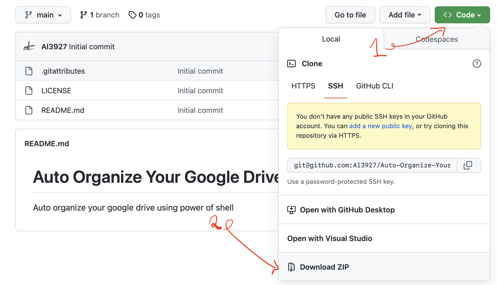

# Auto Organize Your Google Drive

Auto-organize your google drive using the power of shell

## Requirements

- Already installed Google Drive for desktop. If not, click [here](https://www.google.com/drive/download/) to download it from Google.

## How to use

1. Download the repo to your computer, or clone it:



2. Run:

```terminal
chmod u+x auto.sh
./auto.sh "<path of your google drive folder>"
```

To get the path of your Google Drive folder, new Terminal (or Command Prompt,...) in the Google Drive folder and run: `pwd`. This will print the path to the screen.

Usually, the path will contain space: My Drive, so you need to quote the path.
